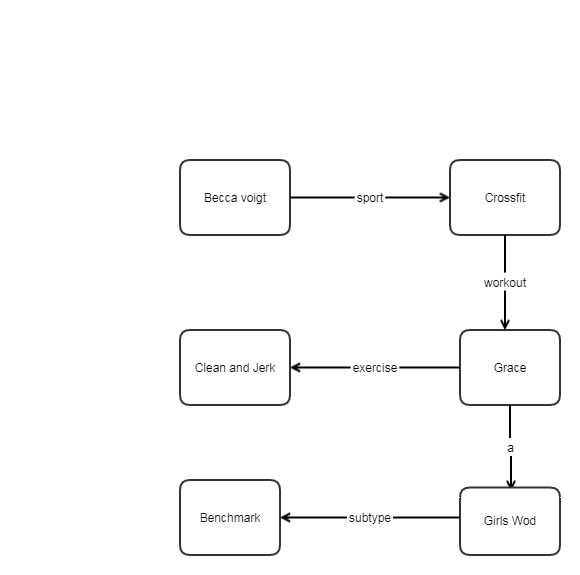
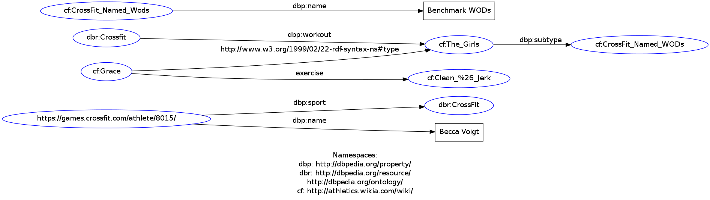

# Semantic Web: Exercises for 25 May
_An De Rijdt_

## Description

Below a small part of Crossfit is described in RDF. Crossfit is a sport which combines elements from gymnastics, weightlifting and cardio.

## Graph

## Turtle

Because not all the resources existed in the laundromat, we used other urls where the objects were referenced.

@prefix dbp:	<http://dbpedia.org/property/> .
@prefix dbr:	<http://dbpedia.org/resource/> .
@prefix : <http://dbpedia.org/ontology/> .
@prefix cf: <http://athletics.wikia.com/wiki/> .
<https://games.crossfit.com/athlete/8015/>	dbp:sport	dbr:CrossFit ;
dbp:name "Becca Voigt" .
dbr:Crossfit dbp:workout cf:The_Girls .
cf:Grace a cf:The_Girls;
         :exercise cf:Clean_%26_Jerk .
cf:The_Girls dbp:subtype cf:CrossFit_Named_WODs .
cf:CrossFit_Named_Wods dbp:name "Benchmark WODs".

## Graph from visualizer

The graph looks a bit different because of the RDF above:

- The use of literals for instance for the athlete's name.
- It seems items are repeated. I do not know if this is for the sake of readibility of the graph or necessary.

